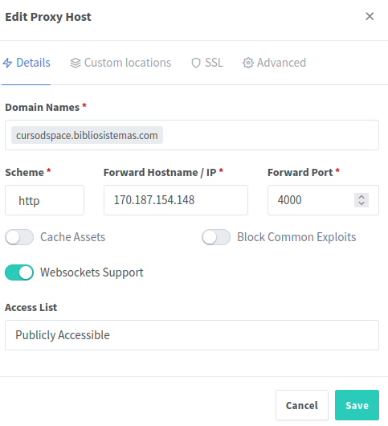
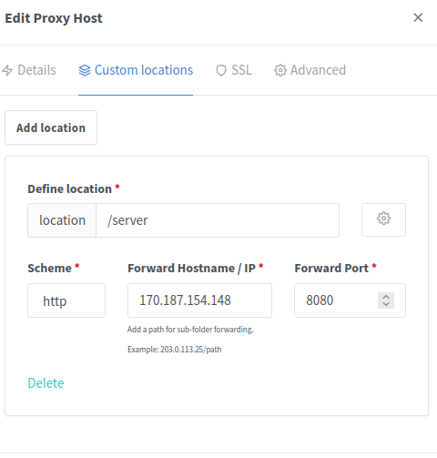
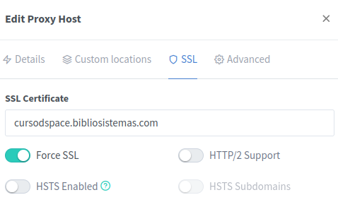

# Instalación de Dspace detrás de un proxy reverso

Los contenedores Dspace-angular y DSpace-api-rest deben accederse (idealmente) desde el mismo dominio para evitar configuraciones complejas de CORS. 
Al correr debajo del mismo dominio nos aseguramos que las peticiones desde el navegador a la API no produzcan errores de cross site scripting. 

Ejemplo de instalacion de dspace en subdominio 
usando [Proxy Manager](https://jc21.com/2018/02/nginx-proxy-manager.html)
Donde 170.187.154.148 es la IP pública del SERVER y cursodspace.bibliosistemas.com es el dominio. 

Usamos el mismo subdominio para montar la API-REST en un subdirectorio  así la API se accede desde \<dominio>/server (esto sin importar donde esté montado el server, ya que podría estar en otra ip interna o externa sin inconvenientes)

Por último es necesario configurar el proxymanager para que instale los certificados SSL

De esta manera podemos acceder a la interfaz angular en el raiz del sitio  y en /server la api. 

